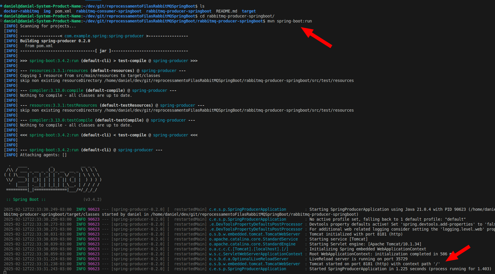
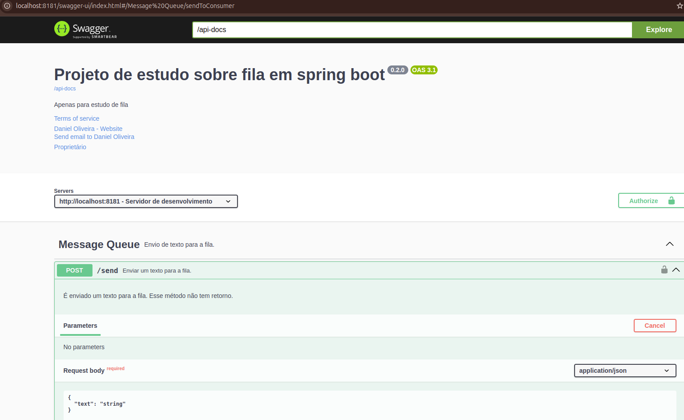
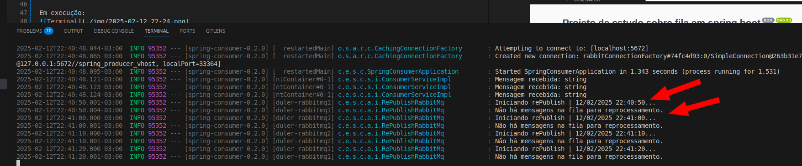
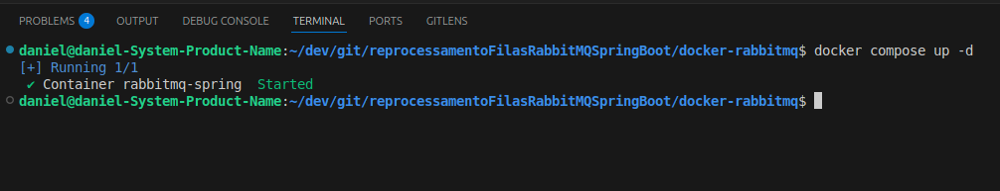
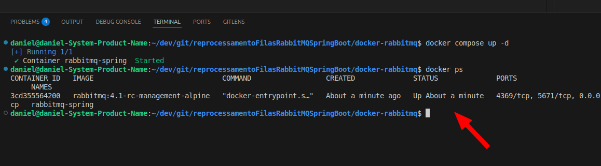
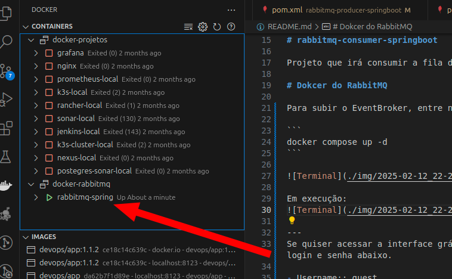

[](https://github.com/danielso2007/reprocessamentoFilasRabbitMQSpringBoot/actions/workflows/maven-publish.yml)

# reprocessamentoFilasRabbitMQSpringBoot

Reprocessamento de Filas RabbitMQ no SpringBoot. Aprendendo a reprocessar filas de forma automática.

### JDK

Para esse projeto, foi usado o Corretto-21.0.4.7.1.

# rabbitmq-producer-springboot

Projeto que irá produzir as mensagens na fila. Para acessar o swagger: [http://localhost:8181/swagger-ui/index.html](http://localhost:8181/swagger-ui/index.html).

## Executando o producer

Acesse a pasta `cd rabbitmq-producer-springboot/` e execute `mvn spring-boot:run`.





### Testes

Para testar o produtor, envie mensagem via swagger. Quando o texto `teste` é enviado, o consumidor rejeita, enviado essa mensagem para o dead letter (Ver abaixo).

# rabbitmq-consumer-springboot

Projeto que irá consumir a fila de mensagens. Para acessar o swagger: [http://localhost:8182/swagger-ui/index.html](http://localhost:8182/swagger-ui/index.html).

Ao receber `"text": "teste"`, a aplicação rejeita (`AmqpRejectAndDontRequeueException`) e envia para a dead letter.

## Executando o consumer

Acesse a pasta `cd rabbitmq-consumer-springboot/` e execute `mvn spring-boot:run`.

### Testes

Ao executar o consumer, ele irá ver se tem mensagens na fila e receber. Essa aplciação também, ao rejeitar uma mensagem, tenta republicar por 3 vezes (configurável), conforme abaixo. Após 3 tentativas, ele adiciona na fila Parking Lost.



# Dokcer do RabbitMQ

Para subir o EventBroker, entre na pasta `/docker-rabbitmq` e execute:

```
docker compose up -d
```



Em execução:


Pelo plugin do vscode:


--- 
Se quiser acessar a interface gráfica do RabbitMQ, acesse [http://localhost:15672](http://localhost:15672) com login e senha abaixo.

- Username:: guest
- Password: guest

### Observação:

Se der erro ao subir o container, remova o container anterior, caso já tenha executado algum docker do rabbitMQ anteriormente. Exemplo: `docker rm <id-container>`.


